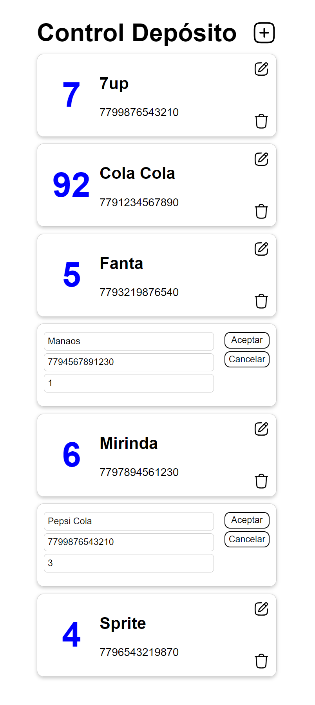

# Trabajo Práctico 3

Este trabajo se considera como el primer parcial.

## Requerimientos
Usted trabaja en una pequeña empresa y debe llevar a cabo el control de cuántas unidades de cada producto hay en el depósito.

El depósito no está bien organizado y aunque no tiene una gran variedad, aproximadamente 30 productos distintos, sí cuenta con un número considerable de unidades, estimando no más de 100 por producto. Algunos productos están agrupados, mientras que otros se encuentran dispersos en diferentes habitaciones. Incluso hay productos en exhibición para la venta que también deben ser contabilizados.

Una opción sería hacerlo con lápiz y papel para luego transferir los datos a una hoja de cálculo de Excel, pero recientemente ha completado un curso de programación en ReactJS. Por lo tanto, decide poner a prueba sus habilidades recién adquiridas desarrollando una aplicación web que facilite el control del inventario del depósito.

Tras reflexionar, se da cuenta de que solo necesita dos datos de cada producto: el nombre y el código EAN, el número que se encuentra justo debajo del código de barras.

Dado que no dispone de un listado de productos, opta por la posibilidad de agregar productos a medida que los va encontrando. Si localiza un producto que ya está en la lista, con solo seleccionarlo, incrementaría la cantidad en una unidad.

Para su comodidad, y siendo el usuario final, decide que debe ser posible editar cualquier producto en cualquier momento; esto incluye corregir el nombre, el código o la cantidad, o incluso eliminarlo directamente. La edición se realizará en el mismo lugar donde se encuentra la información. Aunque pueda parecer excesivo, es una oportunidad para poner a prueba sus habilidades, y por ello, le resulta un desafío interesante.

Finalmente, considera que lo más práctico es que los productos se muestren ordenados alfabéticamente.

Con las ideas claras, procede a realizar un diseño gráfico rápido, con la intención de que el resultado final sea lo más fiel posible al diseño propuesto.

Se trata de un ABM (Alta, Baja, Modificación) simple, y aunque no debería ser complicado de implementar, desea destacarse. Por ello, se tomará una semana para completar el trabajo.
