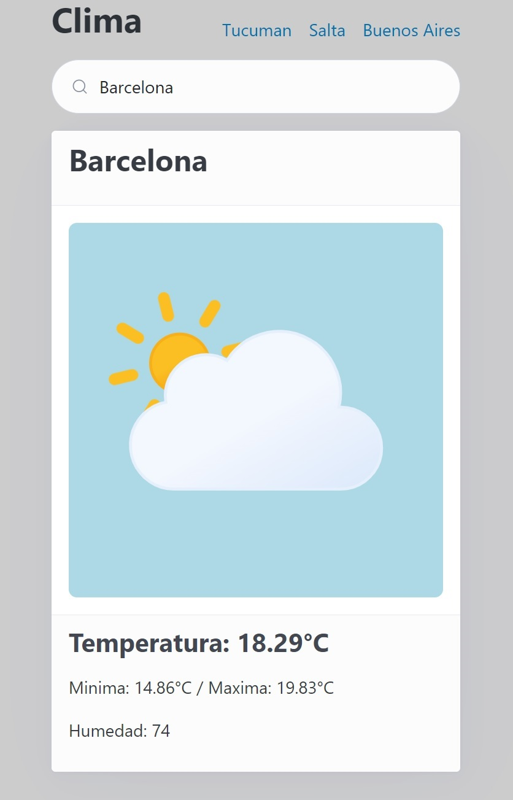

# TP4 

## App: Consultar Clima

Hacer una aplicación que permita mostrar el clima actual en la ciudad elegida.

- Debe tener enlaces para acceder directamente a las ciudades de "Tucuman", "Salta" y "Buenos Aires"

- Debe permitir buscar cualquier ciudad
    - Al escribir debe automaticamente actualizar la ciudad

- Debe mostrar: 
    - El nombre de la ciudad completo
    - La temperatura actual, minima y maxima 
    - La humedad actual
    - Una imagen que represente el clima 

- El trabajo debe ser presentado modificando los archivos que se encuentra en la carpeta TP4 de manera que la aplicacion pueda correr con los archivos presentados (sin nodejs o vite)

> [!INFO]
>
> Para hacer la aplicación recomendamos usar los siguientes recursos:
> - https://openweathermap.org/ 
>    Para consultar el API del clima
>
> - https://picocss.com/
>    Para dar formato a la página
>
>
> - https://bas.dev/work/meteocons 
>    Para los iconos animados que representa el clima actual.
>    (bajar archivo y buscar los iconos para openweathermap)

### Diseño 

---

> [!NOTE]
>
> **Instrucciones para la presentación del trabajo**
> 
> 1. Cambiar a la rama principal (main).
> 2. Descargar la última versión del repositorio del curso (fetch).
> 3. Crear una nueva rama para tus cambios (new branch) (TP4-{alumno}).
> 4. Abrir la carpeta correspondiente a tu nombre de usuario (practicos/{alumno}/TP4).
> 5. Realizar las modificaciones dentro de la carpeta TP4 (sin alterar ninguna otra carpeta).
> 6. Confirmar los cambios (commit).
> 7. Realizar una solicitud de publicación (pull request).
> 8. Revisar que el pull request esté subido (solapa pull request en GitHub).
> 9. Volver a la rama principal (main) para actualizar (fetch) el repositorio.
>
> *Los cambios no aparecerán en el repositorio principal hasta que se acepte el pull request el día del vencimiento del plazo para entregar el trabajo.*